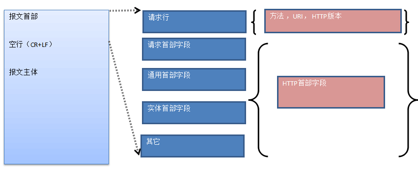
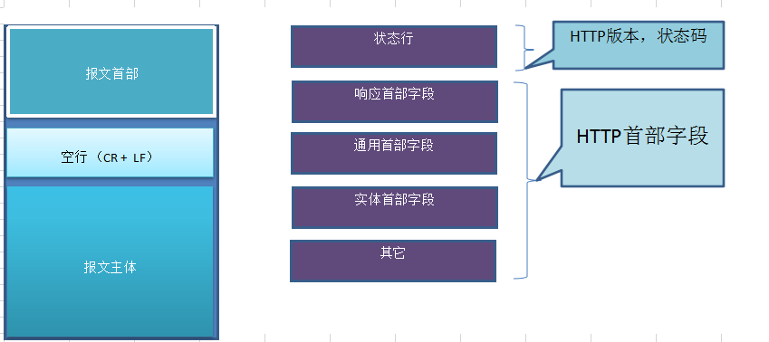

* HTTP报文

HTTP报文大致可分为报文首部和报文主体，两者之间以空行[回车符和换行符]分开。通常，不应会有报文主体

* **HTTP 首部**

* HTTP报文首部

1. 请求行

2. 请求首部字段

3. 通用首部字段

4. 实体首部字段

5. 其它

> 注意：请求行包括（方法，URI，HTTP版本），HTTP首部字段（请求首部字段，通用首部字段，实体首部字段）



* HTTP请求报文:

1. METHOD

2. URI

3. HTTP版本

4. HTTP首部字段

* HTTP响应报文

1. HTTP版本

2. 状态码（数字原因短语）

3. HTTP首部字段




* 报文

是HTTP通信中的基本单位，由8位组字节流组成，通过HTTP通信传输


* 实体

作为请求或响应的有效荷载数据被传输，其内容由实体首部和实体主体组成，HTTP报文的主体用于传输请求或响应的实体主体。
通常，报文主体同于实体主体，只有在进行编码操作的时候，实体主体和报文主体才会产生差异

* 压缩传输的内容编码

内容编码指明应以在实体内容上的编码格式，并保持实体信息的原样压缩，内容编码后的实体由客户端接收并负责解码

常用的内容编码：

1. gzip [GNU zip]

2. compress [unix 系统的标准压缩]

3. deflate [zlib]

4. identity [不进行编码]

* 分割发送分块传输

在HTTP通行过程中，请求的编码实体资源尚未全部传输完成之前，浏览器无法显示请求页面，在传输大容量数据的时候，通过把数据分割成多块，这样让浏览器
逐步显示页面。这种把实体主体分块的功能称为分块传输编码。分块传输编码会将实体主体分成多个部分[块]。每一块都会用十六进制来标记块的大小，而实体
主体的最后一块会使用0（CR+LF）来标记。

* 获取部分内容的范围请求  指定范围发送的请求叫做范围请求[Range Request]

使用范围请求的时候会使用到首部字段 [Range] 
```
Range: bytes=5001-10000 //5001 - 10000

Range: bytes=5001 //5001以后的所有

Range: bytes=-3000, 5000-7000 //从开始到3000，5000-7000的多重范围请求
```

争对范围请求，响应状态码会返回 `206 Partial Content`的响应报文，对于多重范围请求，响应首部字段 `Content-Type`会标明 `multipart/byteranges`

* 内容协商返回最合适的内容

内容协商机制是客户端和服务端就响应的资源内容进行交涉，返回给客户端最合适的内容。主要是就响应资源的语言，字符集，编码方式。。。
内容协商主要有三种类型：

1. 服务器驱动协商 以服务端为主

2. 客户端驱动协商 以客户端为主

3. 透明协商 是服务器驱动和客户端驱动结合体，

* HTTP的返回状态码

### HTTP状态码返回

* 2XX
    
    1. 200 OK
    
    2. 204 not content
    服务器接收的请求已成功处理，但在返回的响应报文中不含实体的主体部分。
    
    3. 206 partial content
    客户端进行了范围请求，服务器成功执行了这部分请求，响应报文中含有content-range指定范围的实体内容

* 3XX
    
    1. 301 moved permanently
    永久性重定向，表示请求的资源已被分配了新的URI。
    
    2. 302 found
    临时移动资源
    
    3. 303 see other
    该状态码表示由于请求对应的资源存在着另一个URI，应使用get方式定向获取请求的资源
    
    4. 304 not modified
    表示客户端发送附带的请求时，服务器端允许访问资源，但未满足条件的情况，304状态码返回
    
    5. 307 temporary redirect
    临时重定向。

* 4XX

    1. 400 bad request
    请求报文中存在语法错误，当错误发生的时候，需要修改请求内容再次发送请求
    
    2. 401 unauthorized
    表示发送的请求需要有通过HTTP认证的认证信息，（如果之前请求过一次，则表示用户认证失败）
    
    3. 403 forbidden
    请求资源的访问被服务器拒绝了 （未获得文件系统的访问权限，访问权限出现问题）
    
    4. 404 not found
    表明服务器上无法找到请求的资源 （服务端拒绝请求不想说明理由的时候使用）

* 5XX

    1. 500 internal server error
    服务端在执行请求时发生了错误，（程序发生致命错误或存在bug或者是临时性故障）
    
    2. 503 service unavailable
    表明服务器暂时处于超负载或正在进行停机维护，现在无法处理请求。


* 通讯数据转发程序 [代理，网关，隧道]

* 代理  代理就是一种有转发功能的应用程序，是属于客户端和服务端的中间人，它接受客户端发送的消息然后再转发给服务端，同时也把服务端的消息转发给
客户端

* 网关 转发其它服务器通信数据的服务器，接受客户端发送过来的的请求时，它就像自己拥有资源的源服务器一样对请求进行处理

* 隧道 在相隔甚远的客户端和服务端两者之间进行中转，并保持双方通信连接的应用程序

