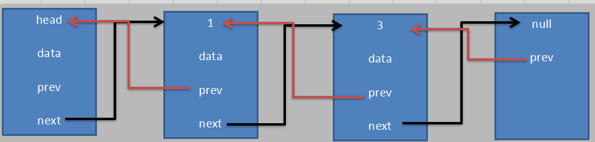
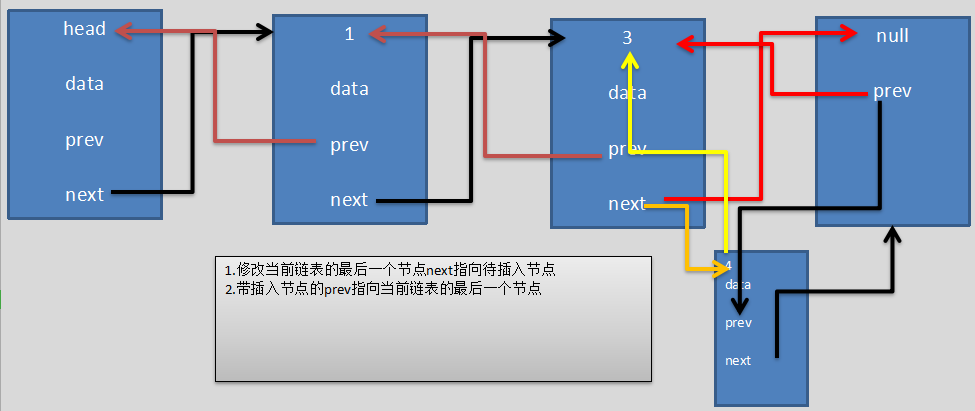

### PHP实现双向链表的增删改查

* 双向链表对比单项链表，有三部分组成：

1. 指针 `next`,指向当前节点的下一个节点

2. 指针 `prev`,指向当前节点的下一个节点

3. 数据存储区 `data`, 当前节点的数据存储区

**有两个指针，代表它更加复杂，同时也代表它比单项链表，既可以从头遍历，也可以从尾部遍历，更加灵活**

**示意图如下：**



#### [初始化一个节点类](./HeadNote.php)

* 主要数据 双向指针，以及节点数据

* 实例如下：

```php
<?php

class HeadNote
{
    /*
     object head 指针，指向头节点，不变也不能被赋值
    */
    public $head;

    /*
     void next 指针，指向下一个节点
    */
    public $next = null;

    /*
     void prev 指针，指向上一个节点
    */
    public $prev;

    /*
     int id id序号
    */
    public $id;

    /*
     string name 名字
    */
    public $name;

    /*
     string nickname 昵称
    */
    public $nickname;

    /**
     * HeadNote constructor.节点构造方法
     * @param int $id
     * @param string $name
     * @param string $nickname
     */
    public function __construct(int $id, string $name, string $nickname)
    {
        $this->id = $id;
        $this->name = $name;
        $this->nickname = $nickname;
    }
}
```

* 向链表最后添加数据，`add(HeadNote $headNote)`

**思路分析：**

> 1.遍历链表，找到链表的最后一个节点，然后修改链表的最后一个节点的指向。2.修改当前链表的最后一个节点next指向待插入节点3.带插入节点的
prev指向当前链表的最后一个节点


**示意图：**



**代码实现：**

```php

```
