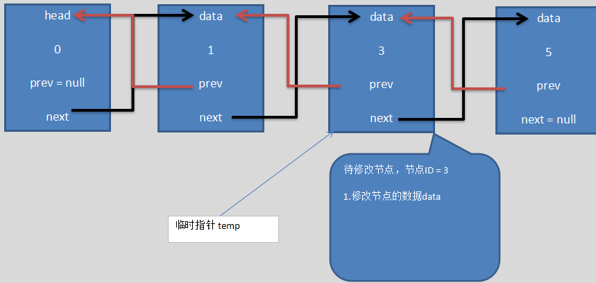

### PHP实现双向链表的增删改查

* 双向链表对比单项链表，有三部分组成：

1. 指针 `next`,指向当前节点的下一个节点

2. 指针 `prev`,指向当前节点的下一个节点

3. 数据存储区 `data`, 当前节点的数据存储区

**有两个指针，代表它更加复杂，同时也代表它比单项链表，既可以从头遍历，也可以从尾部遍历，更加灵活**

**示意图如下：**


#### [初始化一个节点类](./HeadNote.php)

* 主要数据 双向指针，以及节点数据

* 实例如下：

```php
<?php

class HeadNote
{
    /*
     object head 指针，指向头节点，不变也不能被赋值
    */
    public $head;

    /*
     void next 指针，指向下一个节点
    */
    public $next = null;

    /*
     void prev 指针，指向上一个节点
    */
    public $prev = null;

    /*
     int id id序号
    */
    public $id;

    /*
     string name 名字
    */
    public $name;

    /*
     string nickname 昵称
    */
    public $nickname;

    /**
     * HeadNote constructor.节点构造方法
     * @param int $id
     * @param string $name
     * @param string $nickname
     */
    public function __construct(int $id, string $name, string $nickname)
    {
        $this->id = $id;
        $this->name = $name;
        $this->nickname = $nickname;
    }
    
    /**
     * Notes: 以字符串输出
     * Name: __toString
     * User: LiYi
     * Date: 2019/9/9
     * Time: 23:28
     * @return string
     */
    public function __toString()
    {
        // TODO: Implement __toString() method.
        return sprintf("编号是：%d,英雄是：%s,昵称是：%s\n",
            $this->id,
            $this->name,
            $this->nickname
        //$this->next
        );
    }
}
```

* 向链表最后添加数据，`add(HeadNote $headNote)`

**思路分析：**

> 1.遍历链表，找到链表的最后一个节点，然后修改链表的最后一个节点的指向。2.修改当前链表的最后一个节点next指向待插入节点3.带插入节点的
prev指向当前链表的最后一个节点


**示意图：**


**代码实现：**

```php
<?php

class DoubleLinkedList
{
    /*
     object head 指针，指向头节点，不变也不能被赋值
    */
    private $head;

    public function __construct()
    {
        $this->head = new HeadNote(0 ,'', '');
    }

    public function add(HeadNote $headNote)
    {
        //辅助指针，初始话指向头节点
        $temp = $this->head;

        while(true) {
            if ($temp->next === null) {
                break;//链表遍历结束
            }
            $temp = $temp->next;//指针后移
        }

        $temp->next = $headNote;//临时节点的next指针指向待插入节点
        $headNote->prev = $temp;//待插入节点的prev指针指向临时节点
    }
}    
```

* 修改双向链表的某一个节点数据

**思路分析：**

> 修改双向链表的某一个节点的数据，是和单项链表一样，我们传递一个节点对象。通过节点对象的id找到链表中同样存在的节点id，然后修改它的data

**示意图：**



**代码实现：**

```php
<?php

class DoubleLinkedList
{
    /*
     object head 指针，指向头节点，不变也不能被赋值
    */
    private $head;

    public function __construct()
    {
        $this->head = new HeadNote(0 ,'', '');
    }
    
    public function update(HeadNote $headNote)
    {
        $temp = $this->head->next;
        $flag = false;

        while (true) {
            if ($temp === null) {
                break;
            }

            if ($temp->id = $headNote->id) {
                $flag = true;
                break;
            }

            $temp = $temp->next;
        }

        if ($flag) {
            $temp->name = $headNote->name;
            $temp->nickname = $headNote->nickname;
        } else {
            return print_r('待修改节点不存在');
        }
    }
    
}    
```

* 删除一个节点

**思路分析：**

> 首先定义一个辅助指针，在链表中我们头指针不动。1.传递一个需要删除节点的id。2.通过遍历找到需要删除的节点。3.修改待删除节点的前后节点
的指针指向，同时注意，特殊情况，如果待删除节点就是最后一个节点。那么待删除节点的前一个节点的的指针指向后一个节点是没有问题的，后面什么
都没有就是null.就代表删除这个最后一个节点，那么待删除节点的前一个节点就是最后一个节点了。如果我们再把待删除节点的下一个节点的prev指针
指向待删除的前一个节点就会报错。理解：待删除的节点就是最后一个节点，那么它的next就是指为空null,null的prev指针，就是会报错的

**示意图：**


**代码实现：**

```php
<?php

class DoubleLinkedList
{
    /*
     object head 指针，指向头节点，不变也不能被赋值
    */
    private $head;

    public function __construct()
    {
        $this->head = new HeadNote(0 ,'', '');
    }  
   
    public function del(int $id)
    {
        //临时指针，初始指向头节点的下一个节点
        $temp = $this->head->next;
        //记录状态的变量，初始为false
        $flag = false;

        while (true) {
            if ($temp === null) {
                break;//代表链表遍历结束
            }

            if ($temp->id === $id) {
                $flag = true;
                break;//找到了链表中节点ID
            }
            //指针后移
            $temp = $temp->next;
        }

        if ($flag) {
            //改变指针next和prev的指向
            $temp->prev->next = $temp->next;
            if ($temp->next !== null) {
                //如果待删除节点就是最后一个节点，那么把待删除节点的前一个节点next指向待删除节点的下一个
                //节点没有问题，也就是null.
                //但是待删除的节点就是最后一个节点。那么它的next就是指向null,null的前一个节点，这时程序
                //就会报错。所以需要做判断，是否待删除节点就是最后一个节点
                $temp->next->prev = $temp->prev;
            }
        } else {
            return printf("链表中不存在节点ID为：$id 的节点");
        }
    }    
}
```

测试：

```php
require 'HeadNote.php';
$test1 = new HeadNote(1, 'liyi', 'yiyiy');
$test2 = new HeadNote(3, 'haha', 'hahaha');
$test3 = new HeadNote(2, 'haha', 'hahaha');
$test4 = new HeadNote(4, 'haha', 'hahaha');
$test5 = new HeadNote(5, 'liyi', 'yiyiy');

$obj = new DoubleLinkedList();

$obj->add($test1);
$obj->add($test2);
$obj->add($test3);
$obj->add($test4);
$obj->add($test5);

$obj->list();
echo "\n";
$obj->del(3);
$obj->list();
echo "\n";
$obj->del(1);
$obj->list();
echo "\n";
$obj->del(5);
$obj->list();
echo "\n";
$test6 = new HeadNote(2, '王二', '王二麻子');
$obj->update($test6);
$obj->list();
```

[github地址，以及示例代码]()