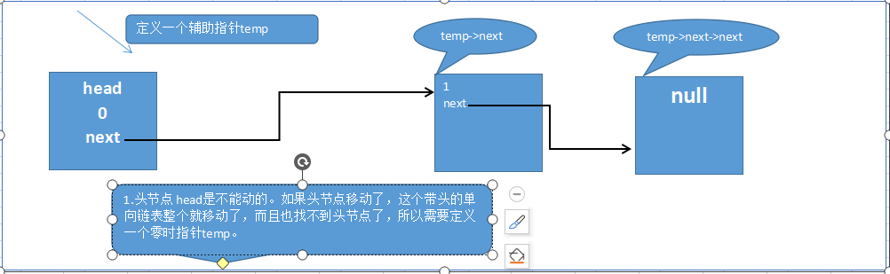
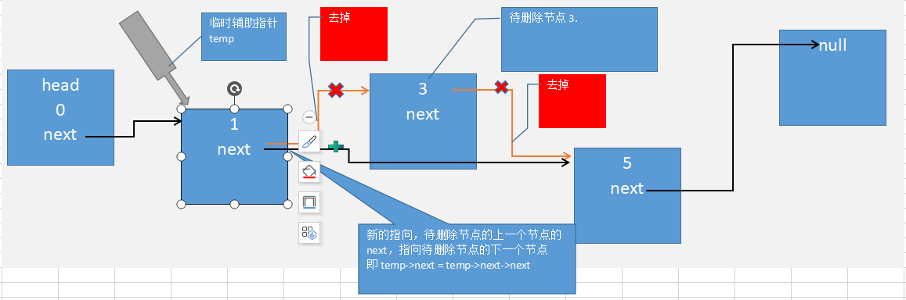
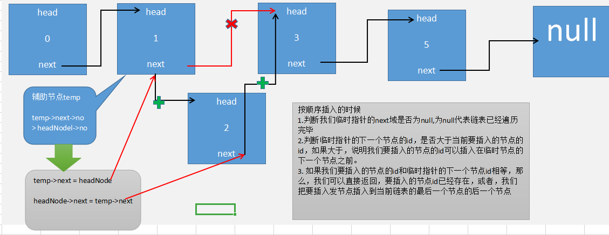

### 链表学习


* 链表以节点的方式来存储

* 每个节点包含data域，next域，指向下一个节点

* 链表分为带头结点和不带头节点

* 链表不一定是连续存储的

**head** 头节点，表示链表的头(头节点不存放具体的数据，但是头结点也不能改变)

**next** 单链表的指针，指向下一个节点

**链表的最后一个节点** 默认是不存放数据，留空，可以设置为 `null`

#### 具体做法

* 申明一个类存放每一个节点数据的类，这个节点的数据`data`可以是任意数据，这里我可以声明一个存放任务的类，`HeadNode`,然后可以默认先存放
人物的`ID`,名字`name`,昵称`nickname`,指向下一个节点的指针`next`等等。。。

>代码实现：

```php
<?php

class HeadNode
{
    /**
    * @var int  人物ID
     */
    public $id;
    
    /**
    * @var string 人物名字 
     */
    public $name;
    
    /**
    * @var string 人物昵称
     */
    public $nickname;
    
    /**
    * @var null 指向下一个节点，默认为null，代表下一个节点为空
     */
    public $next = null;
    
    /**
    * HeadNode constructor.初始化给每一个节点赋值添加数据
    * @param int $id
    * @param string $name
    * @param string $nickname
     */
    public function __construct(int $id, string $name, string $nickname) 
    {
        $this->id = $id;
        $this->name = $name;
        $this->nickname = $nickname;
    }
    
    /**
    Notes:以字符串的形式输出类的具体信息
    Function Name: __toString
    User: Jay.Li
    Date: 2019\9\5 0005
    Time: 9:48
     */
    public function __toString()
    {
    // TODO: Implement __toString() method.
        return sprintf("人物的ID是：%d\t, 人物的名字是：%s\t, 人物的昵称是：%s\t", $this->id, $this->name, $this->nickname);
    }
}
```

* 创建一个链表类，存放节点，`LinkedList`

```php
<?php

class LinkedList
{
    
}
```

* 创建一个初始化的方法，初始化一个单向链表的头结点

```php
<?php

class LinkedList
{
    private $head;
    
    public function __construct() 
    {
        $this->head = new HeadNode(0, '', '');
    }
    
}

```

* 添加节点，把节点添加到链表的尾部`add(HeadNode $headNode)`

**单向链表添加节点的思路：**

> 首先在单向链表中，可以规定，最后一个节点的`next`指针指向null。这样就可以通过遍历找到最后一个节点
`next`域指向null的就代表找到了最后一个节点。找到最后一个之后，把当前链表的最后一个节点的`next`指针指向新添加的这一个节点，新添加的
节点的`next`指针再指向null,这样就添加完成了。

**示意图：**



```php
<?php

class LinkedList
{
    private $head;
    
    public function __construct() 
    {
        $this->head = new HeadNode(0, '', '');
    }
    
    public function add(HeadNode $headNode)
    {
        $temp = $this->head;
        
        while(true) {
            if ($temp->next === null) {
                break;
            }
            $temp = $temp->next;
        }
        
        $temp->next = $headNode;
    }
    
}
```

* 根据传递进来的id参数，然后删掉这个节点 方法`del(int $id)`

**思路分析：**

> 同样的，在删除时，我们也需要遍历整个链表，然后找到节点的id和传递进来id相同的节点，最后删掉它。这个时候也需要一个临时指针`temp`。在
找到这个节点以后，需要我们把待删除这个节点的上一个节点的`next`指针指向待删除节点的下一个节点。即删除完成

**示意图：**



```php
<?php

class LinkedList
{
    private $head;
    
    public function __construct() 
    {
        $this->head = new HeadNode(0, '', '');
    }
    
    public function del(int $id)
    {
        $temp = $this->head;
        $flug = false;//定义一个状态值，默认值false.代表没找到，true代表找到。找到即终止循环
        
        while (true) {
            if ($temp->next === null) {
                break;
            }
            
            if ($temp->next->no = $id) {
                $flug = true;
                break;
            }
            $temp = $temp->next;
        }
        
        if ($flug) {
            $temp->next = $temp->next->next;
        } else {
            return sprintf("链表中不存在此节点： %d\t", $id);
        }
    }
    
}
```

* 修改某一个节点的数据，`update(HeadNode $headNode)`,需要把新节点的数据全部传递进去。然后根据传递进来的节点id，找到链表中的此节点，然后
把链表中此节点的数据更换为新节点的数据，就可以了。

**思路分类：**

> 定义一个辅助指针，`temp`，遍历整个链表，根据节点的`id`找到需要更新的节点。

```php
<?php

class LinkedList
{
    private $head;
    
    public function __construct() 
    {
        $this->head = new HeadNode(0, '', '');
    }
    
    public function update(HeadNode $headNode)
    {
        $temp = $this->head;
        $flug = false;
        
        while (true) {
            if ($temp->next === null) {
                break;
            }
            
            if ($temp->next->no = $headNode->no) {
                $flug = true;
                break;
            }
            $temp = $temp->next;
        }
        
        if ($flug) {
            $temp->next->name = $headNode->name;
            $temp->next->nickname = $headNode->nickname;
        } else {
            return sprintf("待更新节点 %d 不存在", $headNode->no);
        }
    }
    
}

```

* 得到整个链表 `list()`

**思路分析：**

> 利用循环，打印每一个节点，直到最后一个节点为null,结束循环

```php
<?php

class LinkedList
{
    private $head;
    
    public function __construct() 
    {
        $this->head = new HeadNode(0, '', '');
    }
    
    public function list()
    {
        $temp = $this->head;
        
        while (true) {
            if ($temp->next === null) {
                break;
            }
            
            printf($temp);
            
            $temp = $temp->next;
        }
    }
    
}
```

* 按照节点id添加节点到链表，如果节点已经存在，提示节点已经存在，返回提示语。如果节点不存在，则按照id的大小顺序添加到链表

**思路分析：**

> 定义一个临时指针，从头遍历链表。然后首先判单，我们的临时指针`temp`的下一个节点时候为null,为null代表链表已经遍历完成，继续判断，临时
指针的下一个节点的id是否大于待插入节点的id，大于，代表，我们可以把待插入节点插入到临时指针的下一个节点和临时指针之间，第三步判断，临时
指针的下一个节点的id和待插入节点的id是否相等，相等代表待插入节点已经存在。最后改变指针的指向问题就可以了，1.把临时指针的`next`指向待
插入节点。把待插入的节点的`next`指向临时指针的下一个点

**示意图：**



```php
<?php

class LinkedList
{
    private $head;
    
    public function __construct() 
    {
        $this->head = new HeadNode(0, '', '');
    }
    
   public function addOrder(HeadNode $headNode)
   {
       $temp = $this->head;
       $flug = false;
       
       while (true) {
           if ($temp->next === null) {
               break;
           }
           
           if ($temp->next->no > $headNode->no) {
               break;
           } elseif ($temp->next->no === $headNode->no) {
               $flug = true;
               break;
           }
           
            $temp = $temp->next;
       }
       
       if ($flug) {
           return sprintf("待插入的节点的id已经存在，%d\n", $headNode->no);
       } else {
           $temp->next = $headNode;
           $headNode->next = $temp->next;
       }
   }
    
}
```

* 测试一：无序插入

```php
<?php

$test1 = new HeadNode(1, '宋江', '及时雨');
$test2 = new HeadNode(2, '卢俊义', '玉麒麟');
$test3 = new HeadNode(3, '吴用', '智多星');
$test4 = new HeadNode(4, '林冲', '豹子头');
$test5 = new HeadNode(5, '武松', '打虎');

$obj = new LinkedList();
$obj->add($test1);
$obj->add($test2);
$obj->add($test3);
$obj->add($test4);
$obj->add($test5);
$obj->getList();
```

* 测试二：有序插入

```php
<?php

$test1 = new HeadNode(1, '宋江', '及时雨');
$test2 = new HeadNode(2, '卢俊义', '玉麒麟');
$test3 = new HeadNode(3, '吴用', '智多星');
$test4 = new HeadNode(4, '林冲', '豹子头');
$test5 = new HeadNode(5, '武松', '打虎');
$obj->addOrder($test1);
$obj->addOrder($test5);
$obj->addOrder($test1);
$obj->addOrder($test5);
$obj->addOrder($test3);
$obj->addOrder($test4);
$obj->addOrder($test2);

$obj->getList();
```

* 测试三：删除某一个节点

```php
<?php
$obj->del(2);

```

* 测试四：修改某一个节点

```php
<?php

$node = new HeadNode(1, '宋江jinag', '及时雨yu');
$obj->update($node);
```