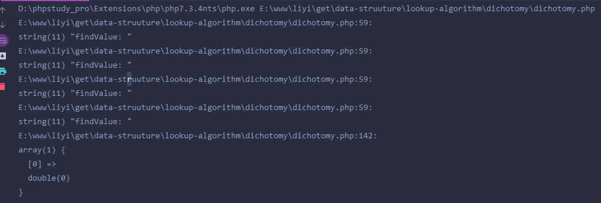
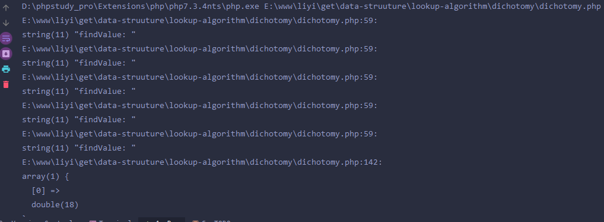

### 插值查找算法

* 对于有序的数列[数组]来说，查找一个具体的数值[数组的value]，可以使用顺序查找，也可以使用前一章节学习的折半[二分法]查找。下面有一个具体的实例：
``$arr = [1,2,3,4,6,7,8,9,10,11,12,13,14,15,16,17,18,19,20]``这是一个分布均匀的有序数组，这次需要查找数组的值为1的键，或者是一个值为20
的键。首先使用顺序查找：

* 顺序查找：当 `findValue = 1` 只需要一次，当`findValue = 20` 就需要差不多二十几次才能找到，可以说是相当的不稳定

* 折半查找：当 `findValue = 1` 如图：



* 折半查找：当 `findValue = 20` 如图：



这里可以看到折半查找需要递归五次才能找到需要的数字，很费事很费力，那么在这种分布均匀的数组中查找一个数值有没有一个讨喜的方法呢，答案是有的：

* 折半查找的公式 `$middle = $leftIndex + ($rightIndex - $leftIndex) / 2`

`` $middle 代表数组的中间值的键， $leftIndex 代表数组的最小索引， $rightIndex 代表数组的最大索引 ``

* 插值查找的公式 `$midlle = $leftIndex + ($rightIndex - $leftIndex) * ($findValue - $data[$leftIndex]) / ($data[$rightIndex] - $data[$leftIndex])`

``$findValue 代表需要查找的值，$data代表的是有序的数组，$midlle,$leftIndex,$rightIndex和上面代表的意思一样``

下面是具体的代码实现：测试发现，对于分布均匀的数组中，查找某一个数值，几乎就是一次就可以找到，很神奇吧.最大的功臣就属于上面的那个公式了。

```php
<?php
/**
 * Notes:
 * File name:${fILE_NAME}
 * Create by: Jay.Li
 * Created on: 2019/12/13 0013 11:40
 */

class SearchValue
{
    protected static $num = 0;

    public function findValue1(array $data, int $leftIndex, int $rightIndex, int $findValue)
    {
        var_dump("循环次数：" . ++self::$num);
        if (!is_array($data)) {
            return ['code' => -1, 'message' => sprintf("$data 非数组")];
        }

        if ($leftIndex > $rightIndex) {
            return ['code' => -2, 'message' => sprintf("此 [ %d ] 不在 $data 中", $findValue)];
        }

        $middleIndex = $leftIndex + ($rightIndex - $leftIndex) * ($findValue - $data[$leftIndex]) / ($data[$rightIndex] - $data[$leftIndex]);

        $middleIndex = intval($middleIndex);
        if ($middleIndex < $leftIndex || $middleIndex > $rightIndex) {
            return ['code' => -3, 'message' => sprintf("中间值的索引 [ %d ] 越界", $middleIndex)];
        }

        $middleValue = $data[$middleIndex];
        if ($findValue < $middleValue) {
            return $this->findValue1($data, $leftIndex, $middleIndex - 1, $findValue);
        } elseif ($findValue > $middleValue) {
            return $this->findValue1($data, $middleIndex +1, $rightIndex, $findValue);
        } else {
            return $middleValue;
        }
    }
}

$obj = new SearchValue();
$data = [1,2,3,4,6,7,8,9,10,11,12,13,14,15,16,17,18,19,20];
var_dump($obj->findValue1($data, 0, count($data) - 1, 20));
```

