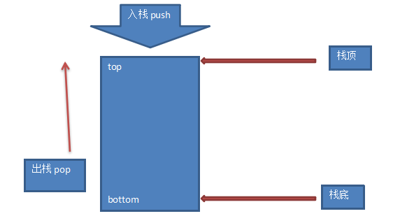

### 数据结构之-栈[数组实现]

* 定义：

在表尾进行插入和删除操作的线性表

* 特性

1. 后进先出，元素先进栈的会最后出来

2. 没有元素的栈为空栈

3. 栈有栈顶和栈底区分，栈顶的元素是最后进栈的元素，栈底是最先进栈的元素

4. 元素从栈里出来，叫做出栈，弹栈[pop]

5. 元素进入栈里，叫做入栈，压栈，进栈[push]

* 如图所示：



在PHP中，数据结构没有明显的区分，一个数据几乎就涵盖了所有的数据结构了，PHP的数组几乎就是万能的，所有的
数据几乎都可以放到数组中。这里就是使用数组来实验栈这个数据结构，步骤如下：

1. 创建一个栈类 `class StackArray`

```php
<?php

class StackArray
{
    
}
```

2. 初始化这个栈的时候，需要做如下操作：2.1 初始化设置一个栈的大小 `private $manSize`

```php
<?php

class StackArray
{
    private $maxSize = 0;
    
    public function __construct(int $maxSize) 
    {
        $this->maxSize = $maxSize;
    }
}
```

3. 定义一个数组，初始化为空数组

```php
<?php

class StackArray
{
    private $stack = [];
}

```

4. 设置一个栈顶的元素，默认为-1,代表此时栈中没有元素

```php
<?php

class StackArray
{
    private $top = -1;
}
```

5. 写两个方法，判断这个数组栈中是否有元素或者栈中元素是否已满

**栈满：** 代表栈中的元素个数和初始化设置的最大个数相等，就代表这个数组栈中元素已经满了

**栈空：** 代表栈顶[top]这个值就是初始化的值 -1

```php
<?php

class StackArray
{
    public function isEmpty():bool
    {
        return $this->top === -1; 
    }
    
    public function isFull():bool
    {
        return count($this->stack) === $this->maxSize;
    }
}
```

6. 入栈数据 [push]

```php
<?php

class StackArray
{
    public function push(int $num)
    {
       if ($this->isFull()) {
           return '栈满，先出栈再添加数据';
       } 
       
       $this->stack[++$this->top] = $num;
       return 'push success!!!';
    }
}

```

7. 出栈数据 [pop]

```php
<?php
class StackArray
{
    public function pop()
    {
        if ($this->isEmpty()) {
            throw new \Exception('栈空，没有数据');
        }
        $temp = $this->top;
        $this->top--;
        
        return $this->stack[$temp];
    }
}
```

8. 测试：

```php

<?php

$obj = new StackArray(5);

$obj->push(10);
$obj->push(20);
$obj->push(30);
$obj->push(40);
$obj->push(50);
try {
    var_dump($obj->pop());
    var_dump($obj->pop());
    var_dump($obj->pop());
    var_dump($obj->pop());
    var_dump($obj->pop());
    var_dump($obj->pop());
} catch (\Exception $e) {
    var_dump($e->getMessage());
}
```

