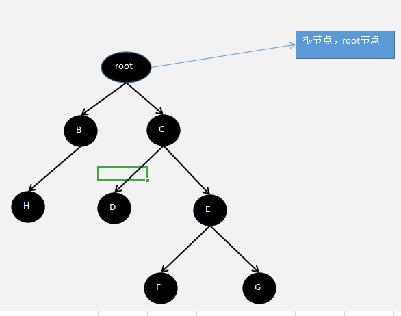
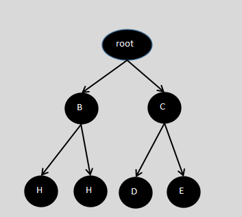
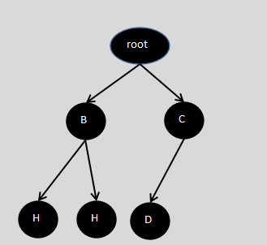

### 二叉树

* tree 如图所示：



1. 根节点 root节点（所有节点由它开始，它没有父节点，只有孩子节点）

2. 节点的度：节点拥有子树的个数

3. 树的度：一棵树中所有节点的度的最大值 

4. 叶子节点：度为0的节点，没有子树的节点，终端节点（A,D,F,G）

5. 分支节点：度不为0的节点，非终端节点(D,C,E)

6. 兄弟节点：拥有同一个父节点的节点(D和E，以及F和G都是兄弟节点。。。)

7. 堂兄弟节点：父节点在同一层的节点（H和D称为堂兄弟节点）

8. 孩子节点：一个节点的直接后继称为该节点的孩子节点（B，C都是Root的孩子节点。。。）

9. 双亲节点：一个节点的直接前驱称为该节点的双亲节点（B的双亲节点就是Root,H的双亲节点是B。。。）

10. 祖先节点，从根节点到当前节点的所有节点都是该节点的祖先（Root->C->E都是G的祖先）

11. 子孙节点，当前节点的以后所有节点都是当前节点的子孙（C的子孙，D，E，F，G）

12. 节点的层次：从根节点开始为1，根的直接后继节点为2，依次类推（root->1;C->2;E->3;F->4）

13. 树的高度：树中所有节点的层次的最大值(4)


* 二叉树特点

1. 每个节点只能有左子节点和由子节点（节点的最大度 <= 2）

2. 每个节点最多只能有两个子节点

3. 满二叉树：所有的子节点都在最后一层，并且节点的总数等于二的n次方减一，n为层数。如图：



4. 完全二叉树：所有的叶子节点都在最后一层或者倒数第二层，而最后一层的叶子节点在左边连续，倒数第二层的叶子节点在右边连续



* 前序遍历：先输出父节点（root节点），再输出左子树，再输出右子树

* 中序遍历：先输出当前节点的左子树，再输出当前节点（父节点），最后输出右子树

* 后续遍历：先输出当前节点的左子树，再输出当前节点的右子树，再输出当前节点（父节点）

* 具体实现：

```php
<?php

class Node
{
    private $id;

    private $name;

    private $left = null;

    private $right = null;

    public function __construct($id, $name)
    {
        $this->id = $id;
        $this->name = $name;
    }

    public function setId($id)
    {
        $this->id = $id;
    }

    public function setName($name)
    {
        $this->name = $name;
    }

    public function setLeft($left)
    {
        $this->left = $left;
    }

    public function setRight($right)
    {
        $this->right = $right;
    }

    /**
     * 1.先输出root节点
     * 2.判断当前节点的左子节点是否为空，如果不为空，递归遍历
     * 3.判断当前节点的右子节点是否为空，如果不为空，递归遍历
     * Notes:前序遍历
     * Name: preorderTree
     * User: LiYi
     * Date: 2020/1/5
     * Time: 19:10
     */
    public function preorderTree()
    {
        echo $this;

        if ($this->left !=  null) {
            $this->left->preorderTree();
        }

        if ($this->right != null) {
            $this->right->preorderTree();
        }
    }

    /**
     * Notes:中序遍历
     * Name: middleTree
     * User: LiYi
     * Date: 2020/1/5
     * Time: 19:10
     */
    public function middleTree()
    {
        if ($this->left !=  null) {
            $this->left->preorderTree();
        }

        echo $this;

        if ($this->right != null) {
            $this->right->preorderTree();
        }
    }

    /**
     * Notes:后续遍历
     * Name: postTree
     * User: LiYi
     * Date: 2020/1/5
     * Time: 19:10
     */
    public function postTree()
    {
        if ($this->left !=  null) {
            $this->left->preorderTree();
        }

        if ($this->right != null) {
            $this->right->preorderTree();
        }

        echo $this;
    }

    public function __toString()
    {
        // TODO: Implement __toString() method.
        return sprintf("当前节点是：%d, name是：%s \n", $this->id, $this->name);
    }
}


class TreeNode
{
    private $root = null;

    public function __construct(Node $root = null)
    {
        $this->root = $root;
    }

    public function middleTree()
    {
        if ($this->root != null) {
            $this->root->middleTree();
        } else {
            var_dump('tree is empty');
        }
    }

    public function postTree()
    {
        if ($this->root != null) {
            $this->root->postTree();
        } else {
            var_dump('tree is empty');
        }
    }

    public function preorderTree()
    {
        if ($this->root != null) {
            $this->root->preorderTree();
        } else {
            var_dump('tree is empty');
        }
    }
}

$node1 = new Node(1, 'liyi');
$node2 = new Node(2, 'liyi2');
$node3 = new Node(3, 'liyi3');
$node4 = new Node(4, 'liyi4');
$node2->setLeft($node4);
$node1->setLeft($node2);
$node1->setRight($node3);
$tree = new TreeNode($node1);
var_dump($tree->preorderTree());
var_dump($tree->middleTree());
var_dump($tree->postTree());

```